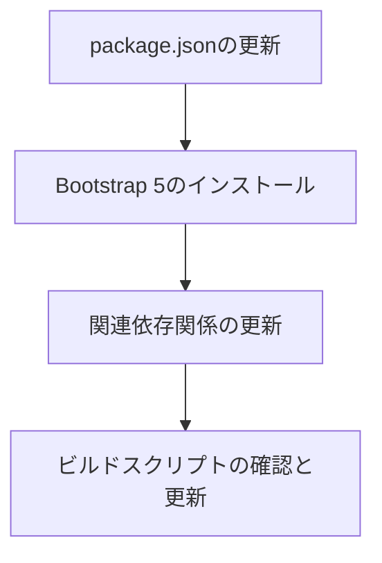
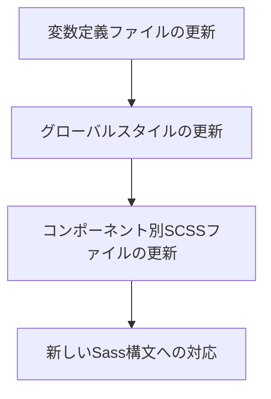
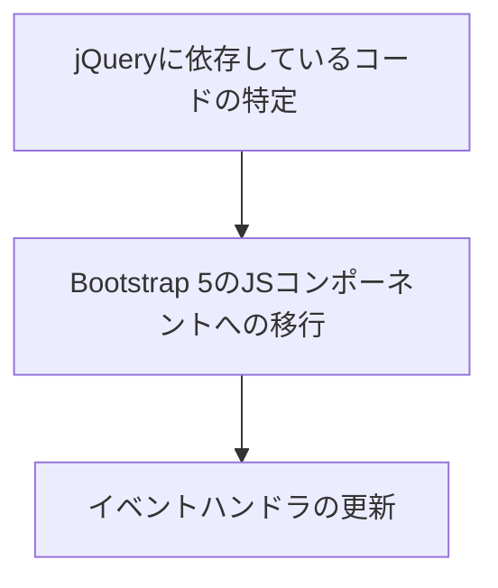
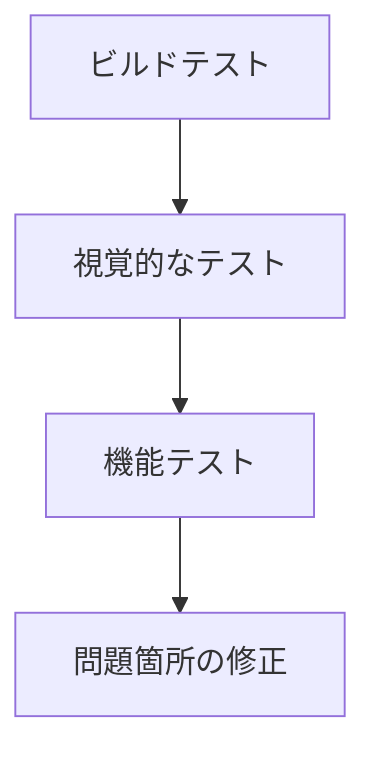

# Bootstrap 4から5への移行計画

## 現状分析

現在のプロジェクト状況：

- Bootstrap バージョン: 4.6.2
- Sass バージョン: 1.89.0（比較的新しいバージョン）
- SCSS ファイルは `src/scss` ディレクトリに集約
- メインの SCSS ファイル（`hashboard.scss`）が Bootstrap をインポートし、カスタマイズを適用

## 主な課題

Bootstrap 4から5への移行では、以下の変更点に対応する必要があります：

1. **jQuery の依存関係の削除**: Bootstrap 5 は jQuery に依存しなくなりました
2. **グリッドシステムの変更**: gutter の扱いなどが変更されています
3. **Sass 変数の名前変更**: 一部の変数名が変更されています
4. **フォームスタイルの変更**: フォームコンポーネントが大幅に変更されています
5. **ユーティリティクラスの変更**: 新しいユーティリティクラスが追加され、一部が変更されています

## 移行計画

以下の手順で移行を進めます：

### 1. 依存関係の更新



- package.json で Bootstrap を 5 系（最新版）に更新
- popper.js の更新（Bootstrap 5 では @popperjs/core を使用）
- 必要に応じて他の依存関係も更新

### 2. SCSS ファイルの修正



- `_hb_bootstrap_override.scss` の変数定義を更新（Bootstrap 5 の変数名に合わせる）
- グリッドシステムを使用している箇所の更新
- フォームスタイルの更新
- 新しい Sass 構文への対応（@import から @use への移行など）

### 3. JavaScript の更新



- jQuery に依存しているコードを特定し、バニラ JS または Bootstrap 5 の JS コンポーネントに移行
- イベントハンドラの更新

### 4. テストと修正



- ビルドが正常に完了するか確認
- 視覚的な問題がないか確認
- 機能的な問題がないか確認
- 問題箇所を特定し修正

## 具体的な作業手順

### 1. 依存関係の更新

```bash
# package.json の更新
npm install bootstrap@5.3.3 @popperjs/core --save-dev
npm uninstall popper.js --save-dev
npm install
```

### 2. SCSS ファイルの修正

#### 変数名の更新

Bootstrap 5 では一部の変数名が変更されています。主な変更点：

- カラー関連の変数名の変更
- グリッド関連の変数の変更
- コンポーネント固有の変数の変更

#### グリッドシステムの更新

Bootstrap 5 では gutter の扱いが変更されています：

- `.row` クラスに `g-*` クラスを追加する必要がある
- `.no-gutters` が `.g-0` に変更

#### フォームスタイルの更新

Bootstrap 5 ではフォームクラスが大幅に変更されています：

- `.form-group` が廃止され、`.mb-3` などのユーティリティクラスを使用
- チェックボックスとラジオボタンのマークアップが変更
- カスタムフォームコントロールのクラス名が変更

### 3. JavaScript の更新

jQuery に依存しているコードを特定し、バニラ JS または Bootstrap 5 の JS API に移行します：

```javascript
// 例: jQuery から バニラ JS への移行
// Before (jQuery)
$('#myModal').modal('show');

// After (Bootstrap 5)
const myModal = new bootstrap.Modal(document.getElementById('myModal'));
myModal.show();
```

### 4. テストと修正

```bash
# ビルドテスト
npm run build

# 開発サーバー起動
npm start
```

## 注意点

1. Bootstrap 5 は Internet Explorer をサポートしていません
2. jQuery プラグインに依存しているコードは代替手段を検討する必要があります
3. 一部のコンポーネントは名前が変更されているか、廃止されています
4. Sass の新しい構文（@use, @forward）を活用することで、より保守性の高いコードになります

## 参考リソース

- [Bootstrap 5 Migration Guide](https://getbootstrap.com/docs/5.0/migration/)
- [Bootstrap 5 Documentation](https://getbootstrap.com/docs/5.3/)
- [Sass Documentation](https://sass-lang.com/documentation/)
