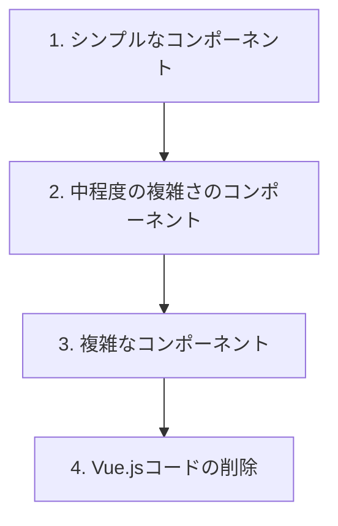

# Vue.jsからReactへの移行計画

## 背景

このプラグインは当初、WordPressがReactを採用するかどうか不明だった時期に開発されたため、Vue.jsを使用していました。現在はWordPressがReactを採用していることが明確になったため、Vue.jsからReactへの移行を行います。

## 現状分析

1. **Vue.jsコンポーネント**:
   - `hb-input`: フォーム入力要素
   - `HbDateRange`: 日付範囲選択（vuejs-datepickerに依存）
   - `hb-loading`: ローディングインジケーター
   - ダッシュボード用のVueインスタンス

2. **依存関係**:
   - Vue.jsはすでにpackage.jsonから削除済み
   - jQueryも併用されており、特にAJAXリクエストやDOM操作に使用

3. **コンポーネントの特徴**:
   - テンプレート構文を使用
   - 双方向データバインディング
   - イベント処理

## 移行計画

### 1. テスト環境の構築

Bootstrap 5への移行と並行して進めるため、テスト環境を構築します。

1. **キッチンシンクページの作成**:
   - `tests/src/kitchen-sink.html`にBootstrap 5のコンポーネント一覧を含むHTMLを作成
   - WordPressプラグインとして動作させるためのPHPコードを追加

2. **テスト用スクリーンの追加**:
   - `tests/app/Bootstrap.php`を拡張して、テスト用のスクリーンを追加
   - キッチンシンクHTMLを読み込んで表示するテンプレートを作成

### 2. 段階的なコンポーネント移行

シンプルなコンポーネントから順に移行します：



#### ステップ1: シンプルなコンポーネント（2-3週間）

1. **Button コンポーネント**
   - Bootstrap 5のボタンスタイルを使用
   - クリックイベントハンドラの実装

2. **Pagination コンポーネント**
   - ページ番号の表示と切り替え機能
   - 現在のページのハイライト表示

3. **Loading コンポーネント**
   - ローディングインジケーターの表示/非表示

#### ステップ2: 中程度の複雑さのコンポーネント（3-4週間）

1. **Input コンポーネント**
   - 編集モードの切り替え
   - 各種入力タイプ（テキスト、テキストエリア、パスワードなど）のサポート

2. **DatePicker コンポーネント**
   - 日付選択機能
   - フォーマット設定

#### ステップ3: 複雑なコンポーネント（4-6週間）

1. **DateRange コンポーネント**
   - 開始日と終了日の選択
   - 日付の検証

2. **Dashboard コンポーネント**
   - Masonryレイアウトの実装
   - 動的コンテンツの表示

#### ステップ4: Vue.jsコードの削除（1-2週間）

1. 新しいReactコンポーネントが正常に動作することを確認
2. 古いVue.jsコードを削除
3. 依存関係の整理

### 3. WordPressとの統合

WordPressの依存関係解決機能を活用します：

1. **スクリプトの登録**:
   - `wp-dependencies.json`にReactとReactDOMの依存関係を追加
   - 各Reactコンポーネントの依存関係を定義

2. **コンポーネントのマウント**:
   - PHPテンプレートにReactコンポーネントのマウントポイントを追加
   - JavaScriptでコンポーネントをレンダリング

## 実装方針

### Reactコンポーネントの実装

```javascript
// src/js/react-components/Button.js
/*!
 * Button component
 * @version 1.0.0
 * @deps react,react-dom,bootstrap
 */

const { createElement } = React;

/**
 * ボタンコンポーネント
 */
const Button = (props) => {
  const { 
    children, 
    variant = 'primary', 
    size = '', 
    onClick, 
    disabled = false,
    icon = null,
    ...otherProps
  } = props;
  
  const sizeClass = size ? `btn-${size}` : '';
  
  return createElement(
    'button',
    { 
      className: `btn btn-${variant} ${sizeClass}`,
      onClick,
      disabled,
      ...otherProps
    },
    [
      icon && createElement('i', { className: 'material-icons', key: 'icon' }, icon),
      children
    ]
  );
};

// グローバルオブジェクトに登録
if (typeof window.Hashboard === 'undefined') {
  window.Hashboard = {};
}
if (typeof window.Hashboard.React === 'undefined') {
  window.Hashboard.React = {};
}
window.Hashboard.React.Button = Button;
```

### WordPressとの統合

```php
// テンプレート内でのReactコンポーネントの使用
<div id="react-button-container"></div>

<script>
jQuery(document).ready(function($) {
  // Reactが読み込まれているか確認
  if (typeof React === 'undefined' || typeof ReactDOM === 'undefined') {
    console.error('React or ReactDOM is not loaded');
    return;
  }
  
  // Hashboard.Reactが存在するか確認
  if (typeof Hashboard === 'undefined' || typeof Hashboard.React === 'undefined') {
    console.error('Hashboard.React is not loaded');
    return;
  }
  
  // ボタンコンポーネントのレンダリング
  if (Hashboard.React.Button) {
    ReactDOM.render(
      React.createElement(Hashboard.React.Button, {
        variant: 'primary',
        onClick: function() { alert('Button clicked!'); }
      }, 'Click Me'),
      document.getElementById('react-button-container')
    );
  }
});
</script>
```

## メリットと課題

### メリット

1. **WordPressとの親和性**: WordPressのコアがReactを使用しているため、親和性が高まる
2. **開発効率の向上**: Reactのエコシステムを活用できる
3. **保守性の向上**: コンポーネントベースの設計により、コードの保守性が向上

### 課題

1. **学習コスト**: Vue.jsからReactへの移行には学習コストが発生
2. **既存コードとの共存**: 移行期間中は両方のフレームワークが共存する
3. **テスト工数**: 各コンポーネントのテストに時間がかかる

## タイムライン

1. **準備期間（1-2週間）**:
   - テスト環境の構築
   - 依存関係の更新

2. **移行期間（9-13週間）**:
   - シンプルなコンポーネント: 2-3週間
   - 中程度の複雑さのコンポーネント: 3-4週間
   - 複雑なコンポーネント: 4-6週間

3. **クリーンアップ（1-2週間）**:
   - Vue.jsコードの削除
   - 最終テスト

## 参考リソース

- [React公式ドキュメント](https://reactjs.org/docs/getting-started.html)
- [WordPress Gutenbergドキュメント](https://developer.wordpress.org/block-editor/)
- [React Hooks API](https://reactjs.org/docs/hooks-intro.html)
